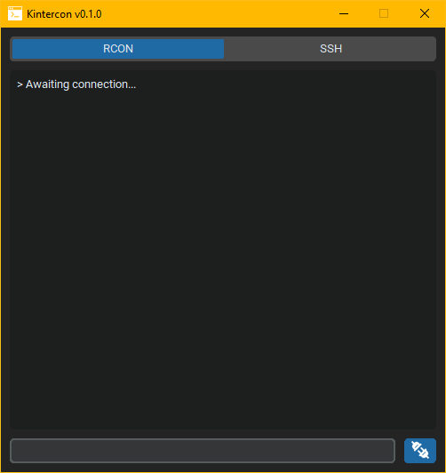

#  Kintercon : Minecraft Remote Console Program 

A remote console written in Python inspired by [Cutercon](https://github.com/Karsteski/Cutercon), using CustomTkinter for the GUI and RCONClient for communication.



## Minecraft Remote Console Protocol

[RCON](https://wiki.vg/RCON) is a TCP/IP-based protocol that allows server administrators to remotely execute Minecraft commands.

## Usage

```commandline
python kintercon.py
```

## Features

Kintercon expands upon the idea of Cutercon by adding SSH support as well as a more fleshed out UI based on CustomTkinter with a dedicated connection panel.

As at its core the UI relies on Tkinter it is incredibly lightweight.

## TODO

- Command history
- Log panel
- Separate RCON/SSH input and output and show/hide on tab switch

## License

MIT License

Copyright (c) 2023 Anthony Forsberg

Permission is hereby granted, free of charge, to any person obtaining a copy
of this software and associated documentation files (the "Software"), to deal
in the Software without restriction, including without limitation the rights
to use, copy, modify, merge, publish, distribute, sublicense, and/or sell
copies of the Software, and to permit persons to whom the Software is
furnished to do so, subject to the following conditions:

The above copyright notice and this permission notice shall be included in all
copies or substantial portions of the Software.

THE SOFTWARE IS PROVIDED "AS IS", WITHOUT WARRANTY OF ANY KIND, EXPRESS OR
IMPLIED, INCLUDING BUT NOT LIMITED TO THE WARRANTIES OF MERCHANTABILITY,
FITNESS FOR A PARTICULAR PURPOSE AND NONINFRINGEMENT. IN NO EVENT SHALL THE
AUTHORS OR COPYRIGHT HOLDERS BE LIABLE FOR ANY CLAIM, DAMAGES OR OTHER
LIABILITY, WHETHER IN AN ACTION OF CONTRACT, TORT OR OTHERWISE, ARISING FROM,
OUT OF OR IN CONNECTION WITH THE SOFTWARE OR THE USE OR OTHER DEALINGS IN THE
SOFTWARE.
